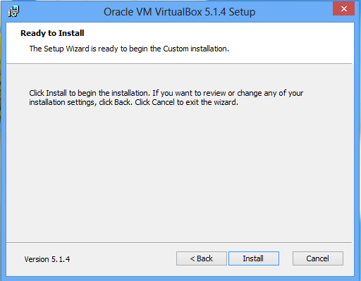
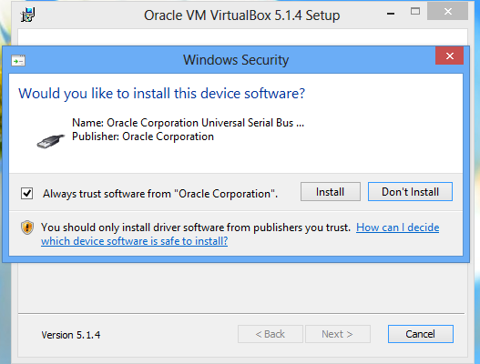
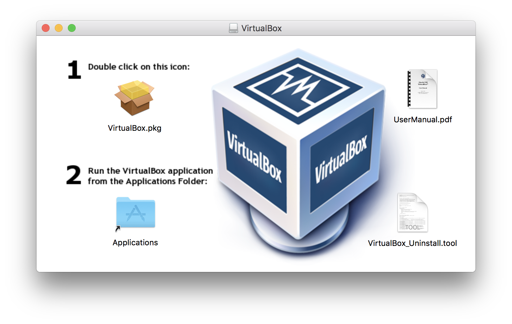
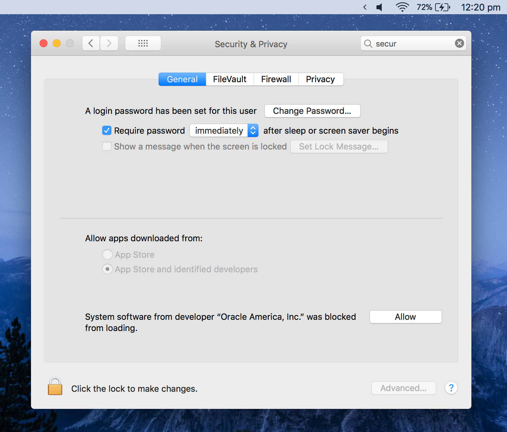
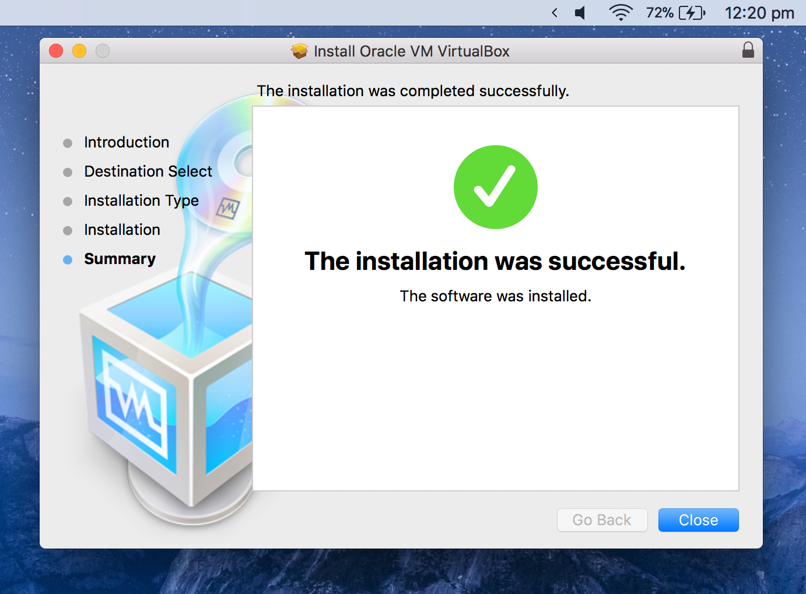
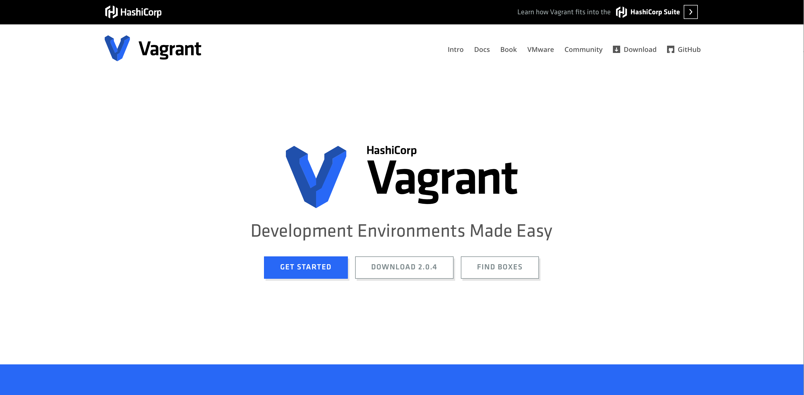
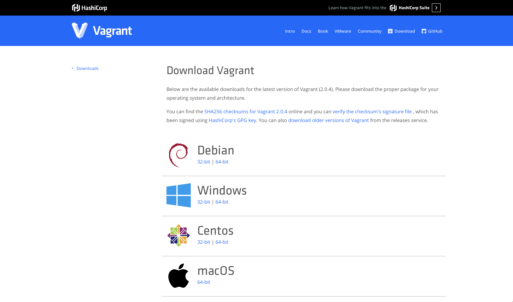

# VirtualBox & Vagrant Installation

The lab environment requires VirtualBox and Vagrant to run.   

VirtualBox is a hypervisor that allows running Virtual Machines on your local workstation and will provide us a lab environment that can be used at any time without having to pay for additional hardware or cloud instances.

Vagrant is a way to automate building the lab environment, it will download the required virtual machine images, configure a private network that they can all communicate on and enable remote access to each of the VMs. 


## Download and install VirtualBox 
VirtualBox is an application that allows you to run VMs on your local machine.  Download it from https://www.virtualbox.org/wiki/Downloads

After downloading VirtualBox continue to the Windows or Mac section below 

### Windows 
Installing VirtualBox on Windows is straight forward and only takes a few steps which are outlined below. 

Run the executable by double clicking on it, and you’ll see a window like below: 


Click “Next” to begin the installation.  During the installation you’ll receive a network warning like below.  This just means you will be disconnected from the network for a second. 


Go ahead and click “Yes” to continue the installation 


Click Install and you’ll see a screen confirming you trust Oracle, and want to install Universal Serial Bus device.  Click “Install” to continue the installation. 




Now continue the wizard until installation is complete. 

### Mac 
To install VirtualBox on MacOS double-click the DMG file downloaded in the previous step to open it and you’ll see the following: 


Follow the instructions and double-click the `Virtualbox.pkg` file to start the installation wizard. 

Click “Continue” in the pop-up window and then again to start the installation.  At this point you may seen an error saying it couldn’t install VirtualBox and to open Security preferences on your Mac.  Click this button, click the lock in the bottom left corner, type in password, and then click “Allow”.  


Rerun the installation and it should succeed. 

  
## Download and Install Vagrant
To download Vagrant load https://www.vagrantup.com in a browser and click on "Download 2.0.4" 




This will take you to a screen where you choose the Operating System you want to download it for. 




Start the installation and go through the simple steps in the wizard. 


## Reboot system 
Now reboot your machine to apply all the network changes `Vagrant` made. 

## Confirmation 
Now confirm everything was installed successfully. 

Open a terminal and type 
```
vagrant version
```

You should see something like: 
```
Installed Version: 2.0.4
Latest Version: 2.0.4

You're running an up-to-date version of Vagrant!
```

# Lab Complete